# MindBridge

An end-to-end EdTech platform where instructors can build and publish courses, and students can browse, purchase, and learn through a structured video curriculum with progress tracking. Built as a self-directed full-stack project (Jan – May 2024) to go deep on the MERN stack, third-party integrations, and production deployment end-to-end.

**Live site:** [mind-bridge-two.vercel.app](https://mind-bridge-two.vercel.app/)


---

## Table of Contents

<!-- - [Screenshots](#screenshots) -->
- [Features](#features)
- [Tech Stack](#tech-stack)
- [System Architecture](#system-architecture)
- [Data Model](#data-model)
- [Key Flows](#key-flows)
- [Engineering Highlights](#engineering-highlights)
- [Getting Started](#getting-started)
- [Environment Variables](#environment-variables)
- [Roadmap](#roadmap)

---

<!-- ## Screenshots

| | |
|---|---|
| **Homepage** 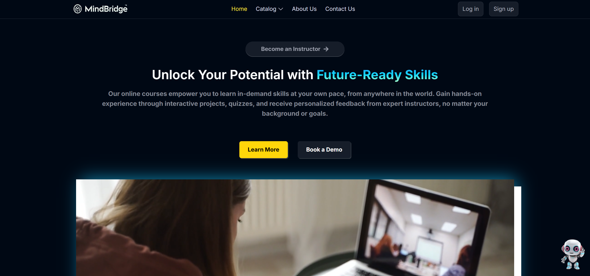 | **Course Catalog** 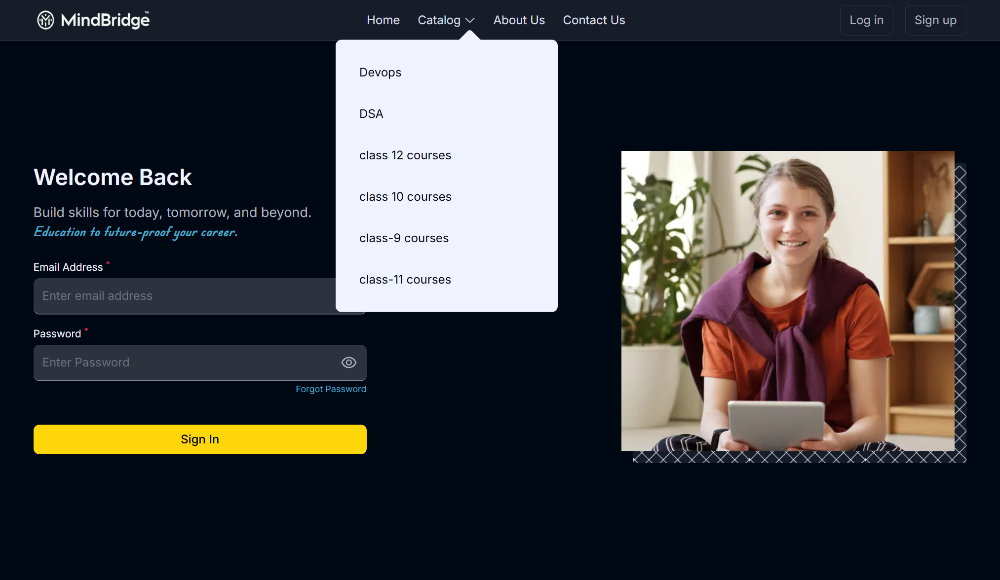 |
| **Course Details**  | **Enrolled Courses & Progress Bar** 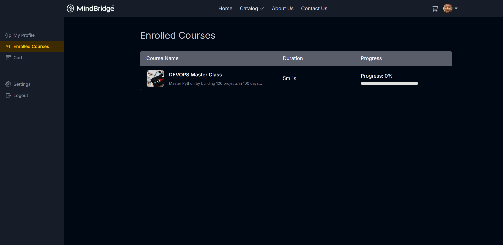 |
| **Student Dashboard** 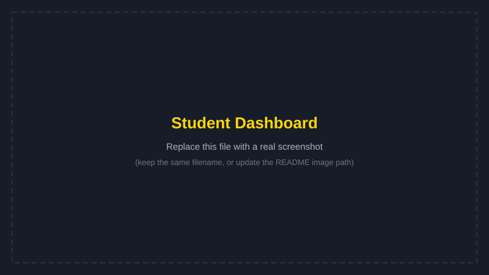 | **Instructor Dashboard** 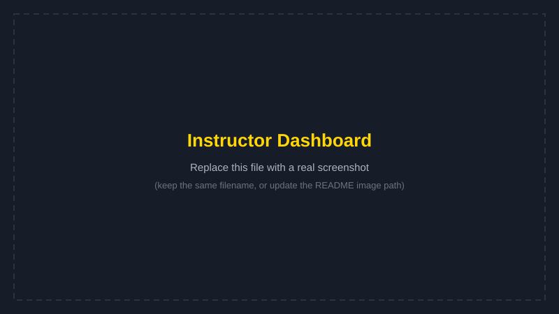 |
| **Add Course Wizard** 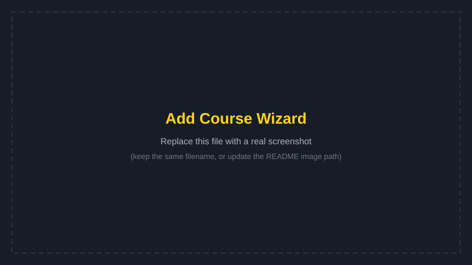 | **Cart & Checkout**  |
| **MediBot Assistant** 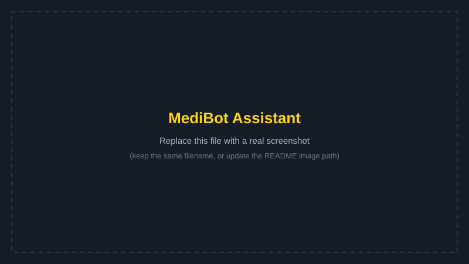 | **Mobile Navigation** 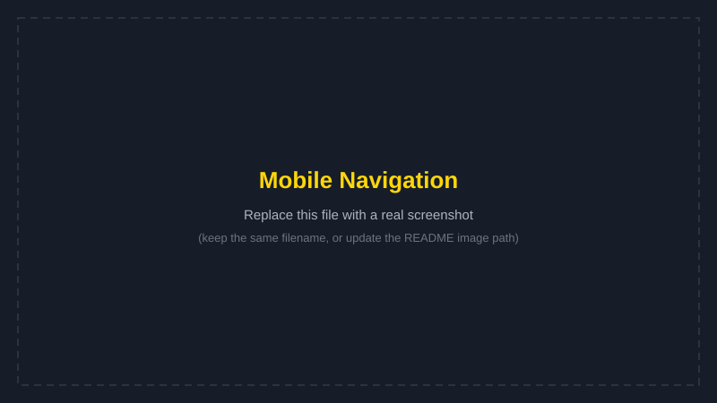 |

--- -->

## Features

**For Students**
- Browse courses by category, view detailed curriculum before purchasing
- Secure checkout via Razorpay, instant enrollment on payment success
- Structured video player with per-lecture progress tracking
- Personal dashboard: enrolled courses, cart, profile management
- Rate and review completed courses

**For Instructors**
- Multi-step course builder: course info → curriculum (sections/sub-sections) → publish
- Video and thumbnail upload via Cloudinary
- Instructor dashboard with enrollment stats and revenue visualization (Chart.js)
- Draft/Published course states

**Platform-wide**
- JWT-based authentication with email OTP verification on signup
- Forgot-password flow with time-limited reset tokens
- Responsive design, including a fully functional mobile navigation menu
- **MediBot** — an in-app AI assistant (Google Gemini) for quick student Q&A
- Category-based course discovery with a live category dropdown

---

## Tech Stack

| Layer | Technology |
|---|---|
| Frontend | React 18, Redux Toolkit, React Router v6, Tailwind CSS |
| Frontend data | Axios, TanStack React Query (caching layer) |
| Backend | Node.js, Express |
| Database | MongoDB (Atlas), Mongoose ODM |
| Auth | JWT, bcrypt, email OTP |
| Media storage | Cloudinary |
| Payments | Razorpay |
| Transactional email | Brevo (HTTP API) |
| AI Assistant | Google Gemini (`@google/genai`) |
| Hosting | Vercel (frontend), Render (backend) |

---

## System Architecture

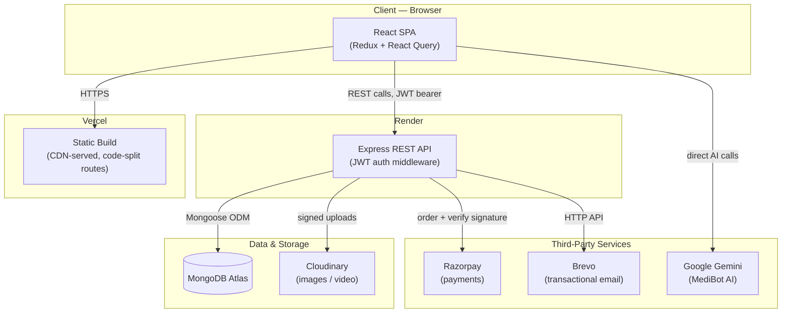

**Design notes:**
- The frontend is a statically-built SPA served from Vercel's CDN, with route-level code splitting so users only download the JS for pages they actually visit.
- The backend is a stateless REST API — no server-side sessions, auth is entirely JWT-bearer-token based — which keeps it trivially horizontally scalable if it ever needed more than one instance.
- MediBot calls Gemini directly from the client rather than proxying through the backend.

---

## Data Model

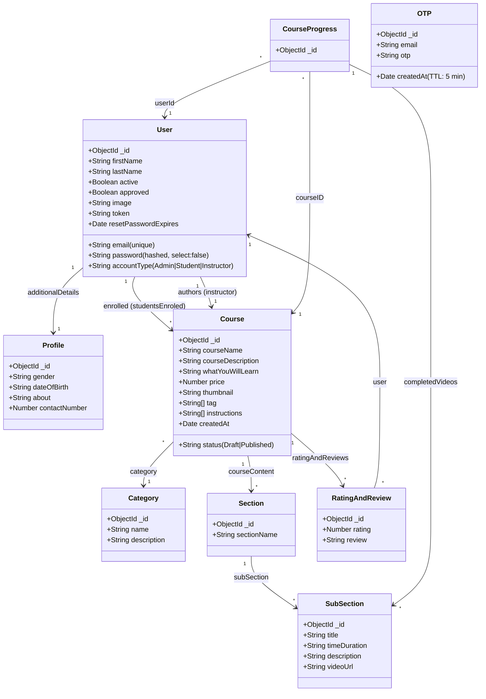

---

## Key Flows

**Signup + Email Verification**
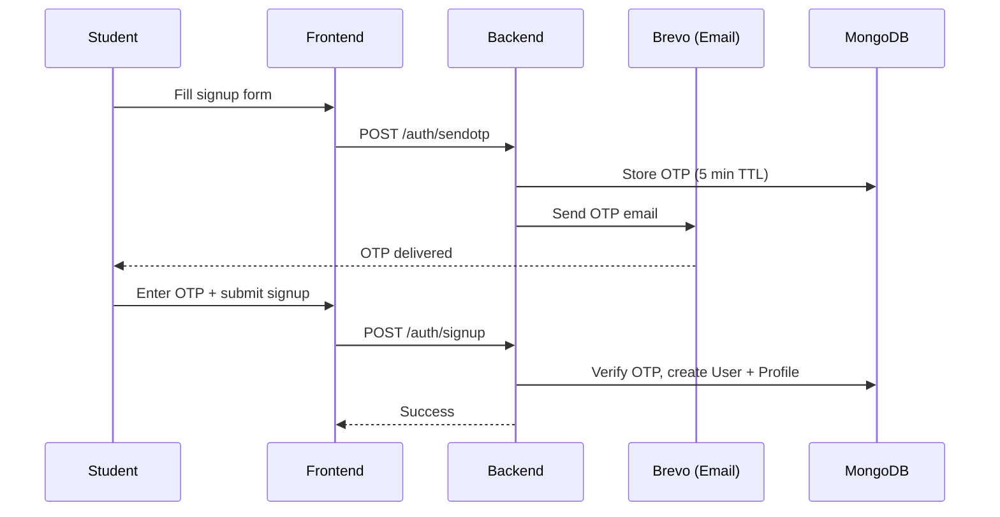

**Course Purchase**
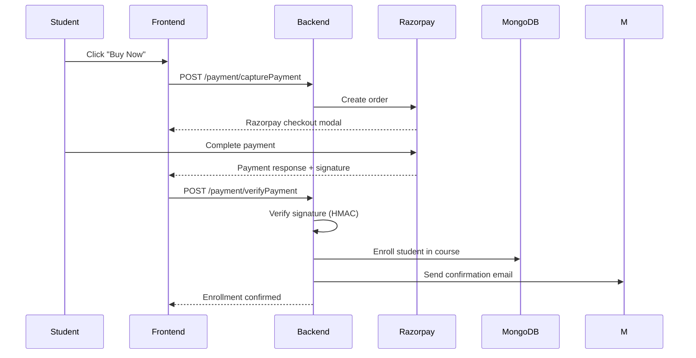

---

## Engineering Highlights

A few things worth calling out beyond "it's a CRUD app":

- **Route-level code splitting** — every dashboard/course route is behind `React.lazy` + `Suspense`, so the initial bundle only ships what the landing page actually needs.
- **Data-fetch caching** — category and course-list fetches moved from raw `useEffect` + Axios to React Query, cutting redundant network calls on every navigation.
- **API response shaping** — course listing endpoints are paginated server-side rather than returning the full published-course set unbounded.
- **Deployment hygiene** — gzip/brotli compression on all API responses, environment-driven config, and a documented, redeploy-triggering environment variable flow across two separate hosting platforms (Vercel + Render).

---

## Getting Started

### Prerequisites
- Node.js 18+
- A MongoDB Atlas cluster
- Cloudinary, Razorpay, Brevo, and Google AI Studio accounts (all have free tiers)

### Frontend
```bash
npm install
npm start
```

### Backend
```bash
cd server
npm install
npm run dev
```

---

## Environment Variables

**Frontend (`.env` at project root)**
```env
REACT_APP_SERVER_URL=http://localhost:4000/api/v1
REACT_APP_API_KEY=your_gemini_api_key
```

**Backend (`server/.env`)**
```env
PORT=4000
MONGODB_URL=your_mongodb_atlas_connection_string
JWT_SECRET=your_random_secret
CLOUD_NAME=your_cloudinary_cloud_name
API_KEY=your_cloudinary_api_key
API_SECRET=your_cloudinary_api_secret
FOLDER_NAME=your_cloudinary_folder
BREVO_API_KEY=your_brevo_api_key
BREVO_SENDER_EMAIL=your_verified_sender_email
RAZORPAY_KEY=your_razorpay_key_id
RAZORPAY_SECRET=your_razorpay_key_secret
```

---

## Roadmap

- [ ] Proxy MediBot's Gemini calls through the backend instead of calling the AI API directly from the client
- [ ] Redis caching layer in front of high-read, low-write endpoints (category list, published courses)
- [ ] Automated test coverage (currently none) and a CI pipeline to run it on every PR
- [ ] Aggregation-pipeline refactor of the deepest course-detail queries to cut down on chained `populate()` round-trips

---

## Author

**Harsh Goel**
Self-directed full-stack project, Jan – May 2024.
